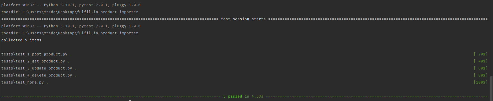

# fulfil.io_product_importer
Designing an API system that allows import of a large CSV file of over 500K rows into an SQL database considering robustness of the API system and scalability

# Getting started
- Clone the repository
- Install requirements.txt file
- Configure RabbitMQ as message broker
- Configure Redis as result backend
- Install and configure postgres
- Created user for RabbitMQ. username: celery, password: celery, vhost: celery
```
$ rabbitmqctl add_user celery celery
$ rabbitmqctl add_vhost celery
$ rabbitmqctl set_permissions -p celery celery ".*" ".*" ".*"
$ rabbitmqctl set_user_tags celery management
```

# Usage
To use the postman collections, check the documentation on the postman collection for sample request and responses.
- When uploading a CSV file at the upload CSV endpoint, key name must be 'file'

# Tech stack
- Flask
- SQLAlchemy
- Celery
- RabbitMQ/Redis
- Postgressql
- Heroku

# Test
